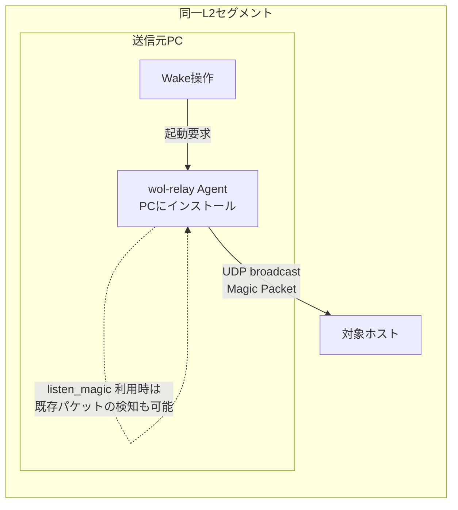
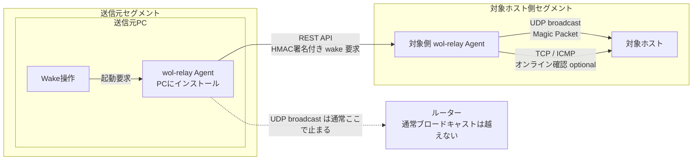
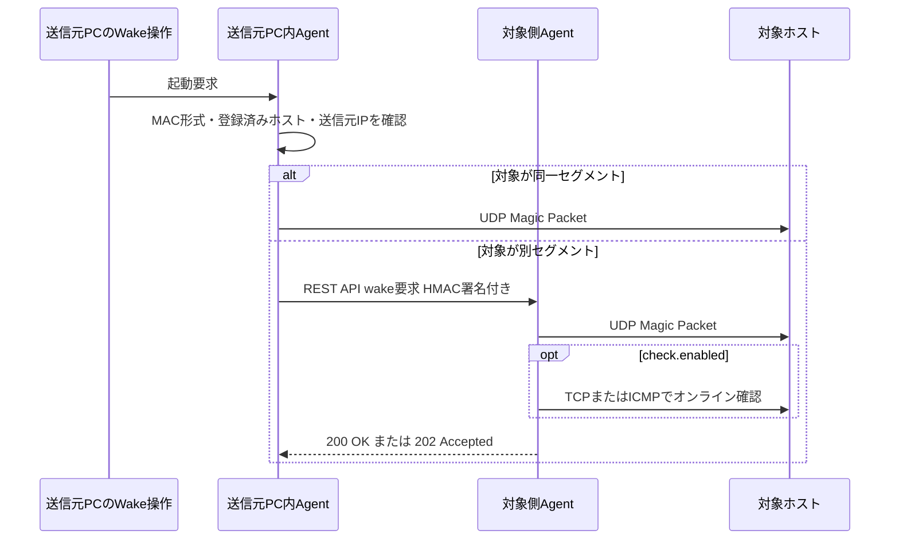

# wol-relay
Wake on LANをセキュアになんとかするアプリケーション

## 仕組み

各クライアントに、 Wake on LAN 用の Agent をインストールします。
例えば、
- PC (マジックパケット送信側)
- マジックパケットを送りたいサーバと同じセグメントにいるノード (Raspberry Piなど)

にインストールしておきます。

Agent は、 マジックパケットの送信を検知すると、
1. そのマジックパケットの送信先が同一セグメントなのかを判定。
2. セグメントが違う場合は、 config で指定していた別の Agent ノードに対して REST API を発行。
3. REST API を受け取った Agent ノードは、対象ホストに対し、マジックパケットを送信。
4. Wake on LAN が成功すると、ステータスコードにて応答。

## マジックパケットが到達する仕組み

Wake on LAN のマジックパケットは、通常 UDP のブロードキャストとして同一 L2 セグメント内に送信されます。送信元 PC にインストールされた wol-relay Agent は、その PC 上で Wake 操作を受け取り、必要に応じて同じセグメント内の対象ホストへマジックパケットを送信します。

また、外部の Wake on LAN ツールから送られたマジックパケットを検知する用途として、wol-relay Agent は `listen_magic` で指定された UDP アドレスを待ち受けます。例えば `":9"` を指定すると、Agent は UDP port 9 に届いたパケットを読み取り、その内容が Wake on LAN のマジックパケット形式かどうかを検査します。



ルーターを越えた別セグメントには、通常このブロードキャストは届きません。そのため、別セグメントの対象ホストを起こす場合は、送信元 PC にインストールされた Agent が Wake 操作を受け取り、対象ホストと同じセグメントにいる Agent へ REST API で依頼します。依頼を受けた Agent が、そのセグメント内で改めてマジックパケットを送信します。



処理の時系列は次の通りです。



実装上は、登録済みホストの MAC アドレスだけをリレー対象にします。未登録の MAC アドレス宛てマジックパケットは無視します。また、マジックパケットがすでに対象ホストと同じセグメントへ届いていると判断できる場合、Agent は再送せず、検知だけを行います。

`allowed_magic_sources` を設定すると、マジックパケットを受け付ける送信元 IP アドレスまたは CIDR を制限できます。OS や Firewall が UDP 待ち受けを遮断している場合、Agent までパケットが届かないため、必要に応じて `wol-relay firewall` で受信許可コマンドを確認してください。

## 対応する環境

以下のOSとCPUアーキテクチャに対応しています。

### OS

- Windows
- macOS
- Linux ベースディストリビューション

### CPUアーキテクチャ

- amd64
- arm64
- arm/v6, arm/v7

## 機能

以下の機能をサポートします。

### ポップアップ通知

- マジックパケットを、他の Agent ノードに送り付けたとき
- Wake on LAN が成功したかしていないか

### セキュリティ

- 非常にセキュアな認証機能によって、各 Agent が安全に通信可能なオプション
- 送信元と送信先をある程度制限するオプション

### 軽量モード

- 初代Raspberry Piなどの非力なマシンでも動作するように稼働するモード

## 実装状況

現在の実装は Go 製の Agent / ネイティブ GUI アプリケーションです。

- REST API 経由の Wake on LAN リレー
- ネイティブ GUI
- UDP で受け取ったマジックパケットの検知とリレー
- TCP / ICMP による起動後のオンライン確認
- HMAC-SHA256 による Agent 間認証
- host / MAC アドレス単位の許可設定
- マジックパケット送信元IPの許可設定
- OS 標準機能を使った通知
- GUI と通知を無効化した軽量ヘッドレスモード
- Linux / macOS / Windows 向けのクロスプラットフォームビルド

Wake on LAN はプロトコル単体では「起動したこと」を確実に返せません。`check.enabled` を有効にしたホストは、マジックパケット送信後に TCP または ICMP でオンライン確認し、確認できた場合は `200 OK`、確認しない場合やタイムアウトした場合は `202 Accepted` を返します。

## インストール

配布されたインストーラーまたは tar.gz を使い、OS に合わせてインストールします。

Windows:

リリースに添付される Velopack 生成の `.msi` をダブルクリックし、Windows Installer のセットアップウィザードに従ってインストールします。`wol-relay-Setup.exe` も配布されますが、これは Velopack の一クリックインストーラーです。

MSI は `Program Files` 配下への per-machine インストールを前提にしています。インストール後は Windows のスタートメニュー、デスクトップショートカット、アプリケーション一覧から `wol-relay Wake on LAN` を起動できます。Windows 検索では `wol-relay` または `wake` で探せるようにしています。

アンインストールは Windows の「設定」または「アプリと機能」から実行します。

macOS / Linux:

```bash
sh ./packaging/install-unix.sh
```

アンインストールする場合:

```bash
sh ./packaging/uninstall-unix.sh
```

設定ファイルも削除する場合:

```bash
REMOVE_CONFIG=1 sh ./packaging/uninstall-unix.sh
```

インストール後はデスクトップやアプリケーション一覧の `wol-relay` から起動できます。

## 使い方

一般ユーザーはCLIを使う必要はありません。`wol-relay` を起動するとネイティブGUIが開き、初回設定ファイルも自動作成されます。起こしたいPCやサーバーはGUIから追加・削除でき、Wakeボタンで起動できます。

別セグメントのホストを起こす場合は、ホスト追加時に `送信先Agent URL` へ対象セグメント側 Agent の URL を入力します。例: `http://<agent-host>:8080`。未入力の場合、リレー先Agentは設定されません。必要に応じて `許可する送信元Agent名` に、このホストのWake要求を許可するAgent名をカンマ区切りで入力します。

Windows では、インストール後にスタートメニューまたはデスクトップショートカットの `wol-relay Wake on LAN` を開きます。macOS / Linux では、アプリケーション一覧の `wol-relay` を開きます。

Linux / macOS で `listen_magic` に `:9` のような privileged port を使う場合は、管理者権限が必要になることがあります。権限なしで動かしたい場合は GUI で高いポート番号に変更できるようにする予定です。

## 管理者・開発者向けCLI

Agent を起動します。

```bash
./wol-relay agent -config wol-relay.json
```

GUI と通知を使わない軽量ヘッドレスモードで起動します。

```bash
./wol-relay agent -config wol-relay.json -light
```

GUI を使う場合は、次のコマンドでネイティブアプリ画面が開きます。

```bash
./wol-relay gui -config wol-relay.json
```

Firewall の受信許可が必要な場合は、設定ファイルから OS 別のコマンド候補を生成できます。出力内容を確認してから管理者権限で実行してください。

```bash
./wol-relay firewall -config wol-relay.json
```

登録済みホストを起こします。

```bash
./wol-relay wake -config wol-relay.json nas
```

設定ファイルを使わず、単発でマジックパケットを送ることもできます。

```bash
./wol-relay send -mac 00:11:22:33:44:55 -broadcast 192.168.10.255:9
```

## 設定例

```json
{
  "node_name": "desktop",
  "listen_http": "127.0.0.1:8080",
  "listen_magic": [":9"],
  "allowed_magic_sources": ["192.168.10.0/24"],
  "default_relay": "",
  "default_target": "255.255.255.255:9",
  "lightweight": false,
  "auth": {
    "shared_secret": "change-me-long-random-secret",
    "allow_insecure": false
  },
  "notifications": {
    "enabled": true
  },
  "hosts": [
    {
      "name": "nas",
      "mac": "00:11:22:33:44:55",
      "ip": "192.168.10.20",
      "broadcast": "192.168.10.255:9",
      "relay": "",
      "allowed_by": ["desktop1", "desktop2"],
      "check": {
        "enabled": true,
        "method": "tcp",
        "port": 22,
        "timeout": "2m",
        "interval": "3s"
      }
    }
  ]
}
```

この JSON は実装上の `Config` / `HostConfig` / `CheckConfig` と対応しています。JSON にはコメントを書けないため、実際の設定ファイルでは上のように値だけを記述してください。

トップレベル項目:

| 項目 | 説明 |
| --- | --- |
| `node_name` | この Agent の名前です。Agent 間 REST API の HMAC 署名時に送信元名として使われ、受信側の `hosts[].allowed_by` と照合されます。未指定時は OS のホスト名が使われます。 |
| `listen_http` | REST API を待ち受けるアドレスです。標準は自PC内からだけ接続できる `127.0.0.1:8080` です。別セグメントの Agent から Wake 要求を受ける対象側 Agent では、その端末の LAN IP を使って `192.168.20.10:8080` のように明示します。`0.0.0.0` は全インターフェース待ち受けになるため、必要な場合だけ Firewall と認証設定を確認して使ってください。 |
| `listen_magic` | 外部 Wake on LAN ツールが送った UDP マジックパケットを検知する待ち受けアドレスの配列です。例: `":9"`。複数ポートを待ち受けたい場合は複数指定できます。 |
| `allowed_magic_sources` | `listen_magic` で受け付ける送信元 IP または CIDR の配列です。空配列または未指定なら制限しません。例: `"192.168.10.0/24"`、`"192.168.10.50"`。 |
| `default_relay` | ホスト個別の `relay` が空のときに使う、送信先 Agent のベース URL です。未設定ならリレーせず、この Agent が直接マジックパケットを送ります。 |
| `default_target` | ホスト個別の `broadcast` が空のときに使う UDP 送信先です。通常は `"255.255.255.255:9"` またはセグメントのブロードキャストアドレスを指定します。 |
| `lightweight` | `true` にすると軽量ヘッドレスモードとして扱い、GUI・通知を使わない運用向けになります。実装上、通知は強制的に無効になります。 |
| `auth` | Agent 間 REST API の認証設定です。 |
| `notifications` | OS 標準通知の設定です。 |
| `hosts` | Wake 対象ホストの配列です。GUI から追加・削除した内容もここに保存されます。 |

`auth` 項目:

| 項目 | 説明 |
| --- | --- |
| `shared_secret` | Agent 間 REST API の HMAC-SHA256 署名に使う共有シークレットです。通信する Agent 同士で同じ値を設定します。十分に長いランダム文字列にしてください。 |
| `allow_insecure` | `true` にすると REST API の HMAC 検証を無効化します。検証用途以外では `false` のまま使ってください。`shared_secret` が空の場合でも、これが `true` でないと設定エラーになります。 |

`notifications` 項目:

| 項目 | 説明 |
| --- | --- |
| `enabled` | Wake 送信、リレー、オンライン確認結果を OS 標準通知で表示するかどうかです。`lightweight` が `true` の場合は、この値に関係なく通知は無効になります。 |

`hosts[]` 項目:

| 項目 | 説明 |
| --- | --- |
| `name` | GUI や CLI で指定するホスト名です。`wol-relay wake nas` の `nas` に相当します。 |
| `mac` | Wake on LAN 対象 NIC の MAC アドレスです。マジックパケット生成と、受信したマジックパケットが登録済み対象かどうかの判定に使います。 |
| `ip` | 対象ホストの IP アドレスです。TCP / ICMP のオンライン確認に使います。また、この IP がローカルマシンの IP と判断できる場合はローカル送信として扱います。 |
| `broadcast` | このホストへ直接マジックパケットを送る UDP 宛先です。空なら `default_target` を使います。例: `"192.168.10.255:9"`。 |
| `relay` | このホストを別セグメント側 Agent に依頼する場合の Agent URL です。例: `"http://192.168.20.10:8080"`。空なら `default_relay` を使い、それも空ならこの Agent が直接送信します。 |
| `allowed_by` | この Agent が REST API で Wake 要求を受けるとき、このホストの起動を許可する送信元 Agent 名の配列です。空なら、HMAC 認証に成功した Agent からの要求を許可します。 |
| `check` | マジックパケット送信後のオンライン確認設定です。 |

`hosts[].check` 項目:

| 項目 | 説明 |
| --- | --- |
| `enabled` | `true` にすると Wake 送信後にオンライン確認を行います。確認できた場合は REST API が `200 OK`、確認しない場合やタイムアウト時は `202 Accepted` を返します。 |
| `method` | オンライン確認方法です。`"tcp"` または `"icmp"` を指定します。未指定で `enabled` が `true` の場合は `"tcp"` になります。 |
| `port` | `method` が `"tcp"` の場合に接続確認する TCP ポートです。例: SSH なら `22`、RDP なら `3389`。 |
| `timeout` | オンライン確認を諦めるまでの時間です。Go の duration 形式で指定します。例: `"2m"`、`"30s"`。 |
| `interval` | オンライン確認を再試行する間隔です。Go の duration 形式で指定します。例: `"3s"`。 |

通知は OS 標準の仕組みを使います。macOS は通知センター、Linux は `notify-send` 経由のデスクトップ通知、Windows は Toast 通知として通知センター / アクションセンターへ表示します。

マジックパケット検知は、登録済みホストだけを対象にします。同一セグメント宛てのマジックパケットを検知した場合は再送せず、別セグメントの登録済みホストだけを設定済み Agent にリレーします。

## 開発者向けビルド

配布用の単体バイナリは Go で作成できます。ネイティブGUIには Fyne を使っているため、配布用ビルドでは `nativegui` タグを指定します。

```bash
go build -tags nativegui -o wol-relay ./cmd/wol-relay
```

Linux / macOS 向けの例:

```bash
GOOS=darwin GOARCH=arm64 go build -tags nativegui -o wol-relay-darwin-arm64 ./cmd/wol-relay
GOOS=linux GOARCH=arm64 go build -tags nativegui -o wol-relay-linux-arm64 ./cmd/wol-relay
```

Windows 向けの配布物は Velopack で生成します。`packaging/build-windows.sh` は Velopack に渡すアプリ本体 `wol-relay.exe` のクロスビルド用です。インストーラー、MSI、アンインストール登録は GitHub Actions の Release workflow で Velopack が生成します。

```bash
sh ./packaging/build-windows.sh
```

MSI 生成には `--msi` / `--instLocation` に対応した Velopack CLI が必要です。CI/CD では `vpk 0.0.1589-ga2c5a97` を明示的に使っています。stable の古い `vpk` ではこれらのオプションが未対応のため、同じ手順をローカルで試す場合もバージョンを合わせてください。

Velopack の MSI ライセンス入力は `.txt` / `.md` / `.rtf` 拡張子が必要なため、CI/CD ではリポジトリルートの `LICENSE` を `packaging/LICENSE.md` として一時コピーしてから `--instLicense` に渡します。

この Velopack CLI 版では MSI の `--instWelcome` / `--instReadme` がウィザード上でテンプレート変数のまま表示されたり、`--instConclusion` の改行が不正に表示されたりする場合があるため、CI/CD では Welcome / Readme / Conclusion の差し込みを使っていません。

Linux でネイティブGUIをビルドする場合は、OpenGL / X11 の開発ヘッダが必要です。CI やヘッドレス環境で単体テストだけを回す場合は、`nativegui` タグなしのビルドでブラウザ互換GUIにフォールバックできます。

## CI/CD

GitHub Actions で CI とリリース用 workflow を分けています。

### CI

`.github/workflows/ci.yml` は Pull Request と `main` への push で動きます。

- `gofmt` の確認
- Linux / macOS / Windows での `go test ./...`
- Ubuntu 上での `nativegui` タグ付きビルド確認
- Windows runner 上での Velopack パッケージ生成確認

### リリース

`.github/workflows/release.yml` は `v*` タグを push したとき、または GitHub Actions の手動実行で動きます。

作成する成果物:

- `wol-relay-Setup.exe`
- `wol-relay-<version>-full.nupkg`
- `wol-relay-<version>-delta.nupkg`
- `wol-relay-<version>.msi`
- `RELEASES`
- `wol-relay_<version>_linux_amd64.tar.gz`
- `wol-relay_<version>_darwin_amd64.tar.gz`
- `wol-relay_<version>_darwin_arm64.tar.gz`

Windows 向け成果物は Velopack で生成します。`Setup.exe` は通常のユーザー向けインストーラー、`.msi` は Windows Installer 統合用です。MSI は per-machine インストールとして `Program Files` 配下に展開され、Windows のアプリケーション一覧とアンインストール機能に登録されます。Linux / macOS 向け tar.gz には、アプリ本体、インストールスクリプト、アンインストールスクリプト、README、LICENSE を含めます。

推奨リリースフロー:

1. Pull Request で CI を通す。
2. `main` へマージする。
3. バージョンを決め、必要なら README やリリースノートを更新する。
4. `v0.1.0` のようなタグを作成して push する。
5. GitHub Actions の Release workflow が各 OS 向け成果物を作成し、GitHub Release に添付する。
6. Windows 実機でインストーラー起動、デスクトップショートカット起動、アンインストールを確認する。
7. Linux / macOS 実機で展開、インストール、GUI 起動、軽量モード起動を確認する。

例:

```bash
git tag v0.1.0
git push origin v0.1.0
```

現時点ではコード署名と notarization は未対応です。Windows SmartScreen や macOS Gatekeeper の警告を減らすには、将来的に証明書を GitHub Actions Secrets に登録し、リリース workflow の成果物作成後に署名ステップを追加します。
